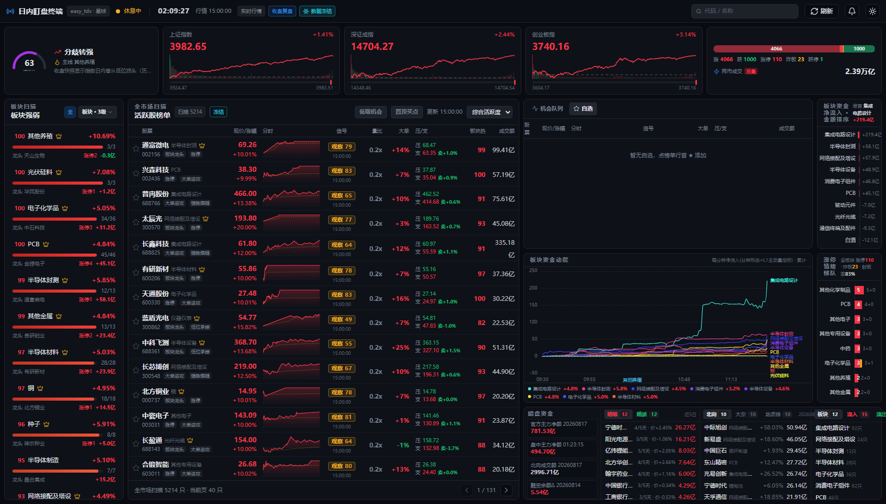
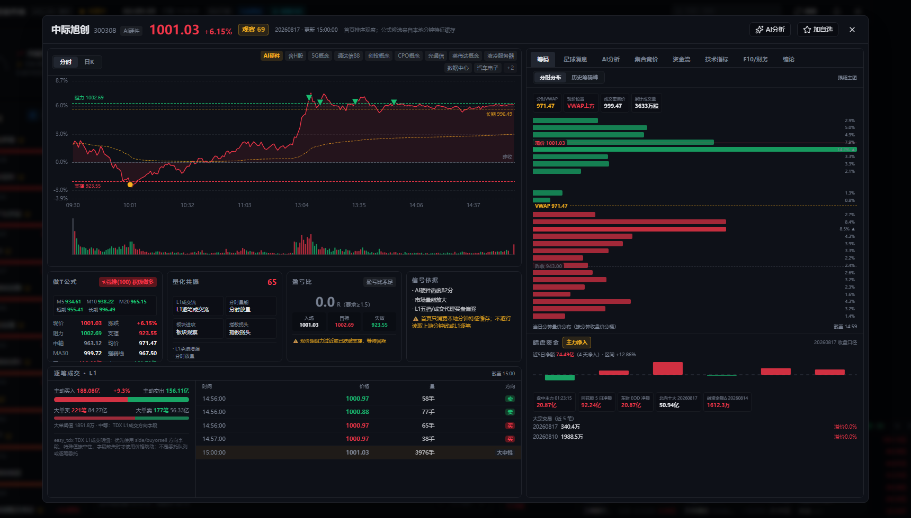

# 日内宏观盯盘

本地运行的 A 股日内盯盘网页。后端负责行情、研究、持久化和接口，前端只展示结果，不暴露 `ts2db_config.yaml` 里的密钥。

## 项目组成

- `app/`：FastAPI 后端，负责行情读取、策略研究、消息 ingest、持久化和 WebSocket 推送。
- `web/`：React + TypeScript + Vite 前端，默认由后端挂载在 `/` 和 `/assets`。
- `scripts/`：采集、研究、校验和维护脚本。
- `data/`：本地配置、主题、规则和运行期数据。
- `docs/`：策略说明、研究记录和架构文档。

## 界面截图

首页是日内盯盘工作台：上方看指数、情绪和成交额，中间扫描活跃股与板块强弱，右侧聚合机会队列、板块资金动能和暗盘资金线索。



个股详情弹窗用于复盘单票：左侧展示分时、做 T 公式状态和 L1 逐笔成交，右侧聚合筹码、星球消息、AI 分析、资金流、F10 和缠论等标签页。



## 快速开始

### 后端

```powershell
python -m venv .venv
.\.venv\Scripts\python.exe -m pip install -e ".[dev]"
.\.venv\Scripts\python.exe scripts\dev_server.py
```

如果系统 `python` 不可用，可以用 Codex 捆绑 Python：

```powershell
& "C:\Users\xpc07\.cache\codex-runtimes\codex-primary-runtime\dependencies\python\python.exe" -m venv .venv
.\.venv\Scripts\python.exe -m pip install -e ".[dev]"
.\.venv\Scripts\python.exe scripts\dev_server.py
```

开发脚本会先结束当前项目里残留的 `dev_server.py` / `uvicorn app.main:app` 进程，避免端口和 SQLite 被多个后端同时占用。默认启用热更新（`--reload`），只监视 `app/` 下的 Python 源码。需要关闭后端热更新时显式设 `WATCH_DEV_RELOAD=0`：

```powershell
$env:WATCH_DEV_RELOAD="0"
.\.venv\Scripts\python.exe scripts\dev_server.py
```

打开浏览器访问 `http://127.0.0.1:8788`。

### 前端

```powershell
cd web
npm install
npm run dev
```

前端默认运行在 `http://localhost:7100`，通过 Vite 代理把 `/api` 和 `/ws` 转到后端 `127.0.0.1:8788`。后端不在该端口时，可用 `WATCH_BACKEND=http://127.0.0.1:8790` 覆盖。

## CloudBase 部署

项目提供一键部署脚本，默认部署到生产环境 `server-d2g7x597t019f5cb0` 的 CloudRun 服务 `watchtower`：

```powershell
.\scripts\deploy_cloudbase.ps1
```

脚本会依次运行后端关键回归测试、构建 `web/dist`、调用 `scripts/package_cloudbase.ps1` 生成干净部署包、执行 `tcb cloudrun deploy --service-name watchtower --env-id server-d2g7x597t019f5cb0 --port 8788 --force`，最后检查生产接口 `/api/health`、`/api/dashboard?view=terminal`、`/api/indices/minutes` 和 `/api/sectors/rank`。

首次使用前需要安装并登录 CloudBase CLI：

```powershell
npm i -g @cloudbase/cli
tcb login
```

常用参数：

```powershell
.\scripts\deploy_cloudbase.ps1 -DryRun -SkipTests
.\scripts\deploy_cloudbase.ps1 -SkipTests
.\scripts\deploy_cloudbase.ps1 -SkipBuild -SkipVerify
```

`-DryRun` 只构建和打包，不改云端资源。若测试阶段出现 `KeyboardInterrupt` 或失败，脚本会在部署前停止；已经单独确认测试通过时，可以用 `-SkipTests` 直接发布。部署后的 smoke check 会重试等待新实例脱离冷启动 bootstrap，并检查大盘分时、板块资金动能是否从早盘开始且尾部接近当前交易进度。部署包只包含 `app/`、`web/dist/`、`data/themes.yaml`、`data/trading_rules.yaml`、`pyproject.toml`、`Dockerfile` 和 `.dockerignore`；脚本会阻止 `ts2db_config.yaml`、本地自选、持仓和 `data/runtime` 进入生产包。

## Web 前端

`web/` 是 React + TypeScript + Vite + Tailwind + shadcn/ui + ECharts 的盯盘界面，深色终端主题，红涨绿跌。构建产物 `web/dist` 由后端直接挂载在 `/` 和 `/assets`。

- 顶栏：连接状态、本地时钟、行情时间、数据模式、决策阶段、冻结标记、手动刷新。
- 市场概览条：情绪半环、市场节奏、主线、三大指数卡、涨跌宽度、涨停/炸板/跌停、两市成交额。
- 左栏：板块强弱、热度分、渐变热度条、上涨占比、龙头和涨停数，支持 1/2/3 级板块切换。
- 中栏：活跃股榜单、迷你分时线、VWAP、信号徽章、量比、反弹/回撤、板块热度、成交额，支持排序和分页。
- 右栏：机会队列、事件流、自选预览；顶部支持代码/名称搜索直达个股详情。
- 个股详情弹窗：分时图、逐笔成交 L1 面板、做 T 公式状态、盘面量化共振、盈亏比评估、星球消息、AI 分析、集合竞价、资金流、F10、缠论标签页。

主接口默认每 5 秒轮询，详情图每 10 秒轮询，暗盘资金面板单独 60 秒轮询 `/api/dark-pool`。逐笔成交按需读取，不进入全市场轮询。React 首页走 WebSocket 增量协议：`/ws/stream?view=terminal&format=delta` 首帧全量快照，之后只推变化分区。旧版 `static/` 原生 JS 界面已删除。

## 运行模式

默认 `WATCH_DATA_MODE=auto`：交易时段优先 `easy_tdx` 实时行情，收盘后自动切到 `easy_tdx` 最近交易日收盘快照。真实行情不可用时页面会明确显示“无真实数据”，默认不会自动使用内置回放。

可手动指定：

```powershell
$env:WATCH_DATA_MODE="replay"
$env:WATCH_DATA_MODE="live"
$env:WATCH_ALLOW_REPLAY_FALLBACK="1"
$env:WATCH_INCLUDE_WATCHLIST="1"
```

默认股票板扫描全市场，不把网页自选股当过滤条件。网页自选只负责置顶、标色和详情分析，不参与默认扫描。需要临时把网页自选也纳入扫描时，可以设置 `WATCH_INCLUDE_WATCHLIST=1`。

终端股票表按综合活跃度展示，并支持板块切换、排序和分页；页面底部会同时显示后端扫描总数，分页不代表过滤。收盘后页面显示 `15:00:00 · 数据冻结`，不会因为 WebSocket 空转反复重绘。

实时刷新默认约 5 秒，板块资金动能默认约 20 秒，可按数据源限频情况调整：

```powershell
$env:WATCH_FULL_MARKET_REFRESH_SECONDS="5"
$env:WATCH_TERMINAL_CONTEXT_LIVE_CACHE_SECONDS="5"
$env:WATCH_SECTOR_FLOW_REFRESH_SECONDS="20"
```

## 数据口径与采集边界

- 板块口径统一以 easy_tdx 官方板块（申万三级，`fetch_board_context` / `_stock_board_display_map`）为唯一标准，盘中与收盘后一致。
- Tushare 只提供个股级资金数值（`moneyflow` / `block_trade`），不参与板块分类；板块汇总一律用 easy_tdx 映射对个股数值归组。
- 手动主题（`data/themes.yaml`）是独立功能，不算板块口径。
- easy_tdx A 股行情可以提供五档委买委卖、`b_vol/s_vol` 汇总主动成交量、分钟成交额和 L1 transaction tape，但不提供委托队列、逐笔委托、十档队列或隐藏主力真相。
- `get_transaction_data` 和 `get_history_transaction_data` 返回的是 L1 成交回报，建议描述为 transaction tape 或 L1 transaction flow，不要统一写成 Level-2。
- 读取逐笔前先判断是否盘中：`is_trading_window()` 为真且请求日期是今天时，用 `get_transaction_data`；非盘中、历史日期、收盘后、周末或节假日时，用 `get_history_transaction_data`。
- 非盘中调试请显式传入有效 `trade_date=YYYYMMDD`，不要在非交易日仍依赖今天日期。
- 逐笔成交只按需读，不加入全市场 5 秒刷新链路。
- `buyorsell` 的特殊值视为中性；优先使用 `buyorsell`，字段缺失时才按相邻成交价方向回推。

### 竞价与盘口

标准 `easy_tdx` 协议会返回五档、主动成交量、当前分钟量、累计成交额和逐笔成交回报，但不返回委托队列。后续分析以逐笔成交回报作为重要成交事实输入，用来确认买盘承接、识别放量抛压和辅助买 T / 减 T 判断；五档深度和分钟成交额只作为辅助代理。

标准协议另外提供 `get_transaction_data` 和 `get_history_transaction_data`。系统只在点开个股详情或调用交易明细接口时按需读取有限条数的真实成交回报。

## 开盘与研究

### 开盘 7 分钟决策标记（已下线）

基于 `docs/opening7_research.md` 的事件研究（自选池 15 只 × 62 个交易日）曾在分时图上叠加开盘 7 分钟制度分层菱形研究标记（09:31 卖出闸门 / 09:33 买入决策）。该叠层已于 2026-08-17 从详情页下线：`GET /api/signals/{code}/detail/overlay` 不再返回 `opening_markers`，前端也不再渲染菱形标记。研究脚本与规则实现（`app/opening7.py`、`scripts/backtest_opening7_sector.py`）保留用于离线回放，不进入线上请求链路。

### 做T分时公式（做T公式.md）

买卖点的唯一来源是通达信分时做T公式的 point-in-time 实现（`app/formula_engine.py`，版本 `zuot_tdx_levels_v1`）：

- 均线系统：`MA30=EMA(C,30)`、`强弱=EMA(C,900)`，分钟级 O(n) 递推，第 i 个状态只用前 i 根分钟线。
- 阻力/支撑/中轴：`H1=MAX(昨收,最高)`，`L1=MIN(昨收,最低)`，`P1=H1-L1`，`阻力=L1+P1*7/8`，`支撑=L1+P1*0.5/8`，`中=(支撑+阻力)/2`，当日为常量。
- 均价：`SUM(V*C,0)/SUM(V,0)`（累计 VWAP）。
- 买卖信号：`买=LONGCROSS(支撑,现价,2)`（回踩支撑），`卖=LONGCROSS(现价,阻力,2)`（冲高兑现）；分时图上以红/绿标记画在对应分钟。
- 机构资金：分钟成交额（万元）= `V*C/100`，`成交额/8>20`（即单分钟成交额 >160 万元）记为大单分钟，按涨跌方向累计 A2/A3，资金流向 = A2-A3。
- 买卖净：当日总额（万元）按外盘/（内盘+外盘）拆分（外盘=主动买、内盘=主动卖）。
- 综合评分：`MA30>强弱` 30 分 + `现价>均价` 20 分 + `A2>A3` 30 分 + `现价>支撑` 20 分，输出五档建议（★强推/☆关注/△观望/○减仓/X规避）。

详情页分时图叠加 MA30/强弱两条曲线和阻力/支撑/中轴三条水平线（`GET /api/signals/{code}/detail/chart` 的 `formula_overlay` 字段）；公式状态卡片数据来自 `formula_state` 字段。旧的 V2/V3 策略、金色共振和研究管线（`/api/research/*`、`scripts/research_t_strategy.py`）已整体移除。

## 持久化与同步

### CloudBase 云托管持久化

CloudBase CloudRun 容器文件系统不是持久化存储，实例重启、扩缩容或重新部署后，本地 `/tmp`、SQLite 和 JSON 文件都可能回到镜像初始状态。生产方案是保持服务无状态：高频行情轨迹仍写本地 SQLite 做运行期缓存，跨重启必须保留的小状态写入 CloudBase NoSQL，知识星球消息历史写入 CloudBase MySQL。

当前镜像默认开启：

```text
WATCH_BACKGROUND_COLLECTOR=1
WATCH_PERSISTENCE_BACKEND=cloudbase_nosql
WATCH_CLOUDBASE_ENV_ID=server-d2g7x597t019f5cb0
WATCH_CLOUDBASE_STATE_COLLECTION=watchtower_state
WATCH_MESSAGE_STORE_BACKEND=cloudbase_mysql
WATCH_CLOUDBASE_MYSQL_INSTANCE=default
WATCH_CLOUDBASE_MYSQL_SCHEMA=server-d2g7x597t019f5cb0
WATCH_DARK_POOL=1
```

需要在 CloudBase 控制台准备 NoSQL 集合 `watchtower_state`，并在云托管服务环境变量里配置服务端 token：

```text
WATCH_CLOUDBASE_API_TOKEN=<CloudBase API Key>
```

`WATCH_CLOUDBASE_API_TOKEN` 只能放在云托管环境变量或本机临时环境变量里，不要写进 Dockerfile、README、`ts2db_config.yaml` 或前端代码。默认实例和数据库都是 `(default)`；如使用非默认库，再设置：

```text
WATCH_CLOUDBASE_DATABASE_INSTANCE=(default)
WATCH_CLOUDBASE_DATABASE_NAME=(default)
```

云端 NoSQL 会保存最新 dashboard 快照和官方板块成员缓存；CloudBase MySQL 会保存 `message_topics`、`message_events`、`message_event_links`、`message_sync_runs` 和物化证据表 `message_evidence_cache`。网页自选股保存在用户浏览器 `localStorage`，并通过请求参数传给看板和详情接口；不同用户看到的自选互不影响，也不会随部署包上传。容器重启后，服务优先从 NoSQL 恢复这些服务端轻量状态，并从 MySQL 读取星球消息证据；服务保持活跃时，后台采集器会继续按行情源重新构建本地轨迹缓存。暗盘资金面板只读本地 EOD 库与东财快照缓存（后台一次性线程补齐），不进入 5 秒全市场刷新链路，也不再轮询磁带。若希望减少冷启动和空档，CloudRun 建议设置最小实例数 `MinNum=1`；如果为了省成本设为 `0`，冷启动后仍可恢复云端持久数据，但运行期 SQLite 缓存需要重新采集。

星球消息证据读取走物化缓存：详情页按 `(scope=stock/sector, cache_key=代码/板块词)` 直接读 `message_evidence_cache`（1~2 次索引查询，亚秒）；未命中的键走动态查询兜底并回写（read-through，空结果也缓存）；每次消息同步后后台自动重建受影响实体的物化值（含板块查询词与链接名的子串别名桥接）。全新部署或物化表被清空后，下一次同步会自动触发一次全量预建，也可手动触发 `POST /api/messages/evidence/prebuild`（需 ingest token）；`scripts/materialize_message_evidence.py` 可在临时开放 MySQL 直连时从本地一次性全量重建（语义与服务端一致）。

### 知识星球消息同步

盯盘系统运行时只读 CloudBase MySQL 中的消息表，不直接读取 `G:\ai\lh\zsxq`，也不再用项目本地 sqlite 保存星球消息。需要先用 MCP/控制台初始化 MySQL 表 `message_topics`、`message_events`、`message_event_links`、`message_sync_runs`、`message_evidence_cache`（`MessageStore.schema_statements()` 里有全部 DDL）。本地知识星球工程同步和归类完成后，用推送脚本把处理好的消息写入盯盘系统：

```powershell
$env:WATCH_INGEST_TOKEN="your-local-secret"
.\.venv\Scripts\python.exe scripts\dev_server.py
.\.venv\Scripts\python.exe scripts\push_zsxq_messages.py --lookback-days 1 --media-mode fast --target-url http://127.0.0.1:8788 --token $env:WATCH_INGEST_TOKEN
```

推送脚本会给每条主题带上 `media_kind`：`text`、`image`、`file`、`voice`、`mixed`。`--media-mode fast` 只推文本/图片；`--media-mode full` 会推全部类型。生产部署时同样只开放 `POST /api/ingest/zsxq/messages` 接收推送，token 放在生产后端环境变量 `WATCH_INGEST_TOKEN`；服务端会把批次写入 CloudBase MySQL。查看同步状态：

```text
GET /api/messages/status
```

`G:\ai\lh\zsxq` 的 Windows 任务现在分成两条：5 分钟一次的 fast 同步负责文本/图片并推送，08:00 的 full 同步负责文件/语音/混合消息、回补和研究刷新后再推送。调度器从 `WATCH_INGEST_TOKEN`、`WATCH_TARGET_URLS`、`WATCH_TARGET_URL`、`WATCH_LOCAL_TARGET_URL`、`WATCH_PUSH_SCRIPT` 和 `WATCH_PUSH_PYTHON` 读取连接信息；token 不写入 Windows 计划任务命令或同步日志。若未配置 token，调度记录会明确显示“未配置 WATCH_INGEST_TOKEN”，不会误报已经推送。

同时推送生产和本地时：

```powershell
$env:WATCH_TARGET_URLS="https://你的生产域名;http://127.0.0.1:8788"
```

## 配置

建议先复制 `ts2db_config.example.yaml` 再按需填写。这个文件不是核心看板的必需项；不配置时，网页看板和行情读取仍可运行，只是 AI 分析、Tushare 收盘落库和消息 ingest 相关能力不可用。

| 字段 | 必要性 | 说明 |
| --- | --- | --- |
| `tushare_token` | 必需（仅 `scripts/ingest_eod_tushare.py`） | 拉取 Tushare 收盘 EOD 数据。 |
| `cf_base_url` + `cf_key` | 需要成组配置，二选一即可 | CloudBase AI 代理。`cf_model_id` 可选。 |
| `deepseek-key` / `zhipu_key` / `bailian_key` / `huoshan_key` | 至少填一组即可 | 选择一个直连 AI 提供方。 |
| `message_ingest_token` / `watch_ingest_token` | 可选 | 消息推送备用配置；生产更建议用 `WATCH_INGEST_TOKEN` 环境变量。 |
| `news_api_key` | 可选 / 预留 | 当前只用于状态展示，主功能不依赖。 |

如果这些 AI 提供方都不填，AI 分析接口会保持不可用，但主看板不受影响。

## 关键文件

- `web/src/lib/localWatchlist.ts`：网页自选股保存在浏览器 `localStorage`，默认不参与全市场股票板扫描。
- `data/themes.yaml`：手工交易主题和核心票映射。
- `data/trading_rules.yaml`：买 T、卖 T、板块强度等阈值。
- CloudBase MySQL `message_*` 表：盯盘系统自己的星球消息库，由 ingest API 写入。
- `data/runtime/auction_snapshots.jsonl`：交易日内可行动竞价候选的采样轨迹。
- `data/runtime/opening_decisions.jsonl`：盘中保存的真实开盘检查点快照，供收盘后复盘。
- `ts2db_config.example.yaml`：空模板，复制成 `ts2db_config.yaml` 后再填写。
- `ts2db_config.yaml`：本地密钥配置，仅在对应功能启用时需要。

## 验证与接口

### 验证

```powershell
.\.venv\Scripts\python.exe -m pytest
```

### 终端接口

```text
GET /api/market/capabilities
GET /api/dashboard?view=terminal&sector=&sort=activity&page=1&page_size=80
GET /api/stocks/board?sector=&sort=activity&page=1&page_size=80
GET /api/auction/{code}?trade_date=YYYYMMDD
GET /api/transactions/{code}?trade_date=YYYYMMDD&count=240
WS /ws/stream?view=terminal&sector=&sort=activity&page_size=80
WS /ws/stream?view=terminal&format=delta&...   # React 首页：快照 + 分区增量
GET /api/signals/{code}/detail
GET /api/signals/{code}/detail/overlay
GET /api/opening/decision
GET /api/messages/status
GET /api/dark-pool
```

盘口字段以逐笔成交回报、成交额和五档深度代理为主，不统一包装成队列结论；easy_tdx 收盘和回放数据会明确显示无实时盘口。

## 相关文档

- `做T公式.md`
- `docs/strategy/opening_3_7_method.md`
- `docs/opening7_research.md`
- `docs/ws_broadcast_plan.md`
- `docs/adr/0001-terminal-frontend-and-data-contract.md`
- `docs/adr/0002-l1-flow-is-a-confidence-input.md`
