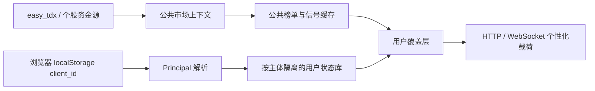

# 匿名客户端用户隔离设计

日期：2026-08-20  
状态：已确认，待实施计划  
适用范围：网页自选股、持仓、终端个性化排序、详情页用户标签、飞书订阅

## 1. 背景与目标

当前系统同时存在三种互相冲突的自选状态：浏览器 `localStorage`、后端单份 `data/watchlist.json`、请求携带的 `watchlist_codes`。后端的单份文件属于整个进程，无法区分访问者；终端排序又会把自选和持仓置顶，因此任一用户的旧数据都可能改变其他用户看到的榜单。

近期生产规模预计为几十名同时在线用户。设计优先级依次为：

1. 用户数据严格隔离，不串自选、持仓或详情标签；
2. 全市场行情、板块、信号保持一份共享真值，避免按用户重复抓取或计算；
3. 首页首屏快，盘中刷新及时；
4. 匿名阶段使用浏览器持久化的 `client_id`，以后可平滑迁移到正式 `user_id`；
5. 个性化存储故障时宁可显示“个人数据不可用”，也不得回退到其他用户或旧全局数据。

本次不实现注册、登录、密码、验证码、权限角色或多设备同步。匿名 `client_id` 是过渡期的主体标识，不等同于正式认证。

## 2. 架构决策摘要

采用“共享行情底座 + 匿名主体覆盖层”：



- 公共层只包含市场事实：行情、板块映射、公共信号、基础活跃度与基础排序。
- 用户层只包含归属和执行约束：自选、持仓、置顶、星标、T+1 可卖限制、个人详情标签。
- 公共市场刷新不读取任一匿名用户的自选或持仓。
- 用户覆盖层不改变 easy_tdx 行情、板块 taxonomy、资金口径、基础信号方向或分数。

## 3. 主体模型

### 3.1 浏览器标识

复用并集中现有 key：

```text
watchtower.client-id.v1
```

值为 `crypto.randomUUID()` 生成的 128 位随机 UUID。前端新建统一的 `clientIdentity` 模块，自选、持仓、终端、详情和飞书订阅不得再各自生成身份。

服务端统一转换为内部主体：

```text
Principal(type="anonymous_client", id=<client_id>)
```

未来登录后可转换为：

```text
Principal(type="user", id=<user_id>)
```

业务仓储和服务均只接受 `Principal`，不直接依赖 UUID 或未来的账号表。

### 3.2 传输规则

- HTTP：使用 `X-Client-ID` 请求头，不放入 URL、查询字符串或业务日志。
- WebSocket：浏览器无法自定义握手头，因此每个需要个性化数据的订阅参数携带 `client_id`。
- 服务端在一个公共函数中校验格式：`^[A-Za-z0-9_-]{8,64}$`。
- 自选、持仓写接口缺少或携带非法 `client_id` 时返回 `422`。
- 终端和详情读接口缺少 `client_id` 时按“无个人数据”返回，并在 `personalization_status` 中标为 `missing_identity`；绝不读取全局文件。
- 日志只记录 `client_id` 的不可逆短哈希，禁止记录原值。

匿名 `client_id` 是随机、不可猜测的 bearer 标识，但不提供账号级身份保证。它只能承载当前产品已接受的匿名偏好与持仓信息；所有传输必须经过 HTTPS/WSS。正式登录上线后，以认证会话为主体真值，客户端传入的 ID 不再具有选择用户的权力。

### 3.3 未来账号迁移

注册或登录成功后，服务端在事务内执行 `merge_principal(anonymous_client, user)`：

- 自选按代码取并集；同一代码的正式账号字段优先，匿名字段只补充正式账号的空字段；
- 持仓同代码冲突时正式账号记录优先，并写入迁移审计结果；
- 飞书订阅和分析记录按产品后续决定是否迁移，本期不把它们隐式混入自选事务；
- 迁移成功后将匿名主体标记为 `merged_to=<user_id>`，后续匿名请求不能继续写入旧主体；
- 迁移必须幂等，重复登录不会重复创建记录或覆盖正式账号数据。

## 4. 存储设计

### 4.1 仓储接口

新增与具体后端无关的 `PrincipalStateRepository`：

```python
get_state(principal) -> PrincipalState
list_watchlist(principal) -> list[WatchlistItem]
upsert_watchlist(principal, item, expected_revision=None) -> PrincipalMutation
delete_watchlist(principal, code, expected_revision=None) -> PrincipalMutation
list_positions(principal) -> list[PositionRecord]
upsert_position(principal, item, expected_revision=None) -> PrincipalMutation
delete_position(principal, code, expected_revision=None) -> PrincipalMutation
import_legacy_watchlist_once(principal, items) -> LegacyImportResult
```

每次成功写入都递增该主体的 `revision`。单项 upsert/delete 是幂等操作；`expected_revision` 可选，用于前端多标签页检测过期写入。冲突时返回 `409` 和最新 revision，前端重新拉取后再展示。

### 4.2 MySQL 表

生产在同一阿里云 RDS 上使用独立数据库 `watchtower_user`，连接配置为 `WATCH_USER_MYSQL_*`。不与 EOD 或消息业务表混用数据库名。

```sql
CREATE TABLE principal_states (
    principal_type VARCHAR(32) NOT NULL,
    principal_id VARCHAR(128) NOT NULL,
    revision BIGINT UNSIGNED NOT NULL DEFAULT 0,
    created_at DATETIME(3) NOT NULL,
    updated_at DATETIME(3) NOT NULL,
    PRIMARY KEY (principal_type, principal_id)
);

CREATE TABLE principal_watchlist_items (
    principal_type VARCHAR(32) NOT NULL,
    principal_id VARCHAR(128) NOT NULL,
    code CHAR(6) NOT NULL,
    name VARCHAR(64) NOT NULL DEFAULT '',
    themes_json JSON NOT NULL,
    core TINYINT(1) NOT NULL DEFAULT 0,
    notes VARCHAR(1000) NOT NULL DEFAULT '',
    created_at DATETIME(3) NOT NULL,
    updated_at DATETIME(3) NOT NULL,
    PRIMARY KEY (principal_type, principal_id, code),
    KEY idx_watchlist_principal (principal_type, principal_id, updated_at)
);

CREATE TABLE principal_positions (
    principal_type VARCHAR(32) NOT NULL,
    principal_id VARCHAR(128) NOT NULL,
    code CHAR(6) NOT NULL,
    payload_json JSON NOT NULL,
    created_at DATETIME(3) NOT NULL,
    updated_at DATETIME(3) NOT NULL,
    PRIMARY KEY (principal_type, principal_id, code),
    KEY idx_positions_principal (principal_type, principal_id, updated_at)
);

CREATE TABLE principal_migrations (
    principal_type VARCHAR(32) NOT NULL,
    principal_id VARCHAR(128) NOT NULL,
    migration_key VARCHAR(64) NOT NULL,
    result VARCHAR(32) NOT NULL,
    created_at DATETIME(3) NOT NULL,
    PRIMARY KEY (principal_type, principal_id, migration_key)
);
```

所有写操作在一个事务内完成：锁定或创建 `principal_states`，修改目标记录，递增 revision，提交。数据库约束 `(principal_type, principal_id, code)` 是隔离的最终防线。

### 4.3 本地开发后端

本地开发允许 `WATCH_USER_STORE_BACKEND=json`，使用按主体分桶的原子 JSON 文件：

```text
data/runtime/principal_state.json
```

文件顶层 key 是 `principal_type:principal_id`，每个桶包含 revision、watchlist、positions 和 migrations。读写使用进程锁、临时文件和原子 replace。

生产必须配置 `WATCH_USER_STORE_BACKEND=mysql`。MySQL 不可用时不得静默退回 JSON；启动健康信息需明确报告用户存储不可用。

原有 `data/watchlist.json` 和 `data/positions.json` 在新链路中只作为管理员手工迁移参考，运行时永不读取。

## 5. 公共市场层与用户覆盖层

### 5.1 公共市场上下文

`DashboardContext` 的市场构建不再注入任何服务端全局 watchlist/positions：

- 全市场 universe 由 easy_tdx 股票列表和项目的公共主题装饰产生；
- `WATCH_INCLUDE_WATCHLIST` 从生产路径移除或固定为 false；
- 公共信号以“未输入个人持仓”计算市场方向、分数和公共风险；
- 公共基础排序不包含 `watchlisted`、`position` 或 `pinned`；
- 板块分类继续严格遵守 easy_tdx 口径，用户覆盖层不得修改分类。

这样所有用户共享一份行情抓取、分钟特征、板块聚合、公共信号和基础排序缓存。

### 5.2 用户覆盖

每次终端/详情构建先从仓储缓存取得 `PrincipalState`，再执行有界覆盖：

1. 自选或持仓代码在当前排序指标内稳定置顶；
2. 当前页挂载 `watchlisted`、`position`、`watchlist_tags`；
3. 生成当前主体独有的 `watchlist_preview` 与 `positions_preview`；
4. 根据当前主体持仓覆盖 `t_plus_one_restricted`、可卖风险和个人执行提示；
5. 详情页按同一主体读取自选、持仓和分析记录归属。

个性化置顶通过“从公共有序 entries 中稳定分区”实现，不重新计算全市场活跃度：

```text
pinned = entries whose code is in user watchlist or positions
normal = remaining entries
personalized = pinned + normal
```

几十人、约 5,000 个 entries、每秒一次的稳定分区开销可控；同一主体同一视图的结果再由短 TTL 缓存复用。

### 5.3 缓存键与失效

- 公共 context/entries 缓存键：交易日、行情更新时间、板块口径、筛选、排序；不含用户信息。
- 主体状态内存缓存键：`principal_type + principal_id`，正常读取 TTL 30 秒。
- 当前进程内写成功后立即替换该主体缓存，不等待 TTL。
- 个性化 terminal payload 缓存键：公共 context signature、主体 ID 的短哈希、主体 revision、视图参数、分时缓存 epoch。
- 用户 A 的写入只失效 A 的个性化缓存，不清空公共行情或用户 B 的缓存。
- 当前为单容器部署；未来多副本时，revision 从数据库读取并通过 Redis/pub-sub 或短轮询做跨实例失效。本期不引入 Redis。

## 6. API 与 WebSocket 合同

### 6.1 自选和持仓 API

保留现有资源路径，但身份只来自 `X-Client-ID`：

```text
GET    /api/watchlist
POST   /api/watchlist
PUT    /api/watchlist/{code}
DELETE /api/watchlist/{code}

GET    /api/positions
POST   /api/positions
PUT    /api/positions/{code}
DELETE /api/positions/{code}
```

列表响应统一携带：

```json
{
  "items": [],
  "revision": 12,
  "personalization_status": "ready"
}
```

写响应返回服务端 canonical item 和新 revision。前端可以乐观更新星标，但必须用写响应校正；写失败则回滚并展示错误。

### 6.2 终端和详情

- HTTP 终端/详情从 `X-Client-ID` 解析主体。
- `/ws/live` 的 terminal/detail 订阅参数使用唯一命名 `client_id`。
- 迁移期服务端可兼容读取 `clientId`，记录弃用指标；前端只发送 `client_id`。
- `watchlist_codes` 不再作为权威输入，也不得作为无身份时的回退。兼容参数保留一个发布周期后删除。
- 终端响应携带服务端 revision 和 `personalization_status`，用于前端识别是否已经应用最新写入。

WebSocket 频道 key 在进程内包含完整主体 ID 和视图参数，因此不同主体不会共享已经叠加个人数据的频道；完整 ID 不写入日志或指标。频道发布者每 tick 调用服务层；服务层当前 revision 进入个性化 payload 缓存键，所以写成功后下一 tick 即可获得新快照/增量，无需重新抓取全市场行情。

## 7. 浏览器状态与旧数据迁移

### 7.1 权威关系

- `client_id`：浏览器 `localStorage` 为权威，服务端只校验和使用。
- 自选/持仓：服务端仓储为权威。
- 浏览器可缓存最近一次服务端数据以改善首屏，但不得把缓存重新覆盖到已存在的服务端状态。

### 7.2 一次性自选迁移

旧 key `watchtower.watchlist.v1` 通过专用接口迁移：

```text
POST /api/watchlist/import-legacy
X-Client-ID: ...
```

服务端在事务内执行 migration key `browser_watchlist_v1`：

1. 若 migration 已记录，直接返回服务端 canonical 列表；
2. 若当前主体自选为空，批量导入合法且去重后的旧列表；
3. 若当前主体已有自选，跳过导入，避免旧缓存复活已删除股票；
4. 无论导入还是跳过，都记录 migration 结果；
5. 前端收到成功响应后写本地迁移完成标记并删除旧 watchlist key。

该接口最多接受 200 只股票，不接收 `client_id` 于请求体。旧全局 `data/watchlist.json` 不自动分配给任何访问者，避免把管理员历史自选复制给所有用户。

## 8. 性能与刷新策略

- easy_tdx 全市场行情仍按现有约 2 秒公共缓存刷新，WebSocket 盘中仍按 1 秒 tick 推送。
- 新增用户不会增加行情源请求数；只增加一次主体状态缓存读取和轻量稳定分区。
- 主体状态首次读取访问 MySQL，后续 30 秒内命中内存；写入即时更新缓存。
- 终端首屏继续只组装 40 条可见行及对应缩略图，不为每个用户预构建全部行模型。
- MySQL 查询均使用主键或 `(principal_type, principal_id)` 索引，几十人规模不需要 Redis、消息队列或独立用户服务。
- 公共 payload 和个性化 payload 分层计时，健康状态暴露缓存命中率和构建耗时，但不暴露主体 ID。

性能验收目标：

- 热缓存终端服务层 p95 个性化覆盖耗时低于 50 ms；
- 自选写入成功到同连接看到正确星标/置顶不超过 1 个 WebSocket tick；
- 增加 50 个不同 client_id 不增加 easy_tdx 全市场抓取频率；
- 个性化数据库热查询 p95 低于 20 ms。

## 9. 故障处理与安全边界

### 9.1 用户存储故障

- 读失败：公共行情继续返回，个人列表为空，`personalization_status="unavailable"`，UI 显示明确提示。
- 写失败：返回 `503`，前端回滚乐观星标。
- 禁止回退到 `data/watchlist.json`、`data/positions.json`、其他主体缓存或请求中的 `watchlist_codes`。
- 存储恢复后下一次读自动恢复个人覆盖，不需要重启行情层。

### 9.2 身份与隐私

- `client_id` 至少 128 位随机熵，最大长度 64，拒绝非法字符。
- 请求体不能指定 owner/principal，避免 mass-assignment 越权。
- 所有用户仓储查询必须同时包含 `principal_type` 和 `principal_id`。
- HTTPS/WSS 为生产强制要求；nginx 和应用日志对 `X-Client-ID`、WebSocket params 做脱敏。
- 限制每个主体最多 200 只自选、200 条持仓，限制 notes/themes 大小。
- 匿名身份不提供找回和跨设备同步保证；清除浏览器 localStorage 会产生新主体。正式注册后再提供绑定、恢复和审计。

## 10. 可观测性

新增不含 PII 的指标/状态：

- 用户存储 backend 和可用性；
- principal state cache hit/miss；
- personal overlay 构建耗时；
- legacy import applied/skipped/failed 计数；
- 缺失/非法 client_id 计数；
- WebSocket 个性化频道数和频道上限使用率；
- revision conflict 数。

日志使用请求 trace ID 和主体短哈希关联，不记录完整 client_id、自选内容或持仓明细。

## 11. 测试与验收

实施必须先写失败测试，再修改生产代码。最低覆盖：

### 11.1 仓储隔离

- A 添加自选后 A 可见、B 不可见；
- A 删除自选不影响 B 的同代码自选；
- 自选和持仓的复合主键都包含 principal；
- 并发写 revision 单调递增，过期 expected revision 返回 409；
- MySQL 失败时不读取旧全局 JSON。

### 11.2 API 与 WebSocket

- HTTP header 和 WS `client_id` 解析成相同 Principal；
- 缺失身份的读请求返回空个人状态，写请求拒绝；
- 两个 client_id 同时订阅相同市场视图，不会收到对方 preview、星标、持仓或 revision；
- A 写入后一个 tick 内收到正确 delta/snapshot，B 无个人数据变化；
- 驼峰兼容仅在迁移期生效，`watchlist_codes` 不能覆盖服务端状态。

### 11.3 公共行情共享

- 50 个主体读取同一视图时，全市场 context/entries 只构建一次；
- 任一主体增删自选不会触发 easy_tdx 全市场刷新；
- 公共排序值、行情更新时间、板块映射和信号分数对所有主体一致；
- 用户差异只出现在置顶顺序、个人标记、preview 和持仓执行约束。

### 11.4 迁移

- 服务端为空时旧浏览器自选只导入一次；
- 服务端已有数据时跳过旧列表；
- 用户删除全部自选后刷新页面，旧列表不会复活；
- 无合法 client_id 不执行迁移。

### 11.5 生产冒烟

使用两个全新随机 client_id 并行执行：A 加入股票、B 保持为空、两者连接终端、A 删除股票。核对 HTTP 与 WSS 结果、RDS 行归属、easy_tdx 抓取次数和 p95 时延。测试完成后删除两个测试主体的数据。

## 12. 发布与回滚

按以下顺序发布：

1. 在 RDS 创建 `watchtower_user` 和表，配置最小权限数据库账号；
2. 部署支持 Principal、双参数兼容和新仓储的后端，但运行时不读取旧全局文件；
3. 同一镜像部署发送 `X-Client-ID` / `client_id` 的前端及一次性迁移；
4. 用两个主体执行生产冒烟；
5. 观察一个发布周期后移除 `clientId` 和 `watchlist_codes` 兼容；
6. 备份但不再挂载旧全局 watchlist/positions 文件。

回滚只回滚应用镜像，不删除新表。旧版应用不能再次暴露给多用户生产流量，因为它会恢复全局自选/持仓语义。若必须紧急回滚，应暂时关闭自选和持仓写入口，并让终端按无个人数据运行。

## 13. ADR：为什么选择共享底座加覆盖层

### 决策

共享所有市场事实和重计算结果，只按主体生成轻量个性化覆盖。

### 替代方案

1. 每个主体构建完整终端上下文：实现直观，但重复全市场遍历、信号装饰和序列化，用户增长会线性放大资源消耗。
2. 浏览器传完整自选列表：读路径快，但服务端无权威状态，多标签页、换设备和缓存迁移容易不一致，也无法可靠支持未来账号合并。

### 结果

公共行情准确性和刷新频率不受用户数影响；个人数据隔离有明确仓储边界。代价是需要把现有 `DashboardContext` 中混合的公共/个人职责拆开，并维护两层缓存。

## 14. ADR：为什么匿名阶段仍使用服务端持久化

### 决策

浏览器只持有 `client_id` 和非权威首屏缓存；自选与持仓由服务端按 Principal 持久化。

### 替代方案

完全使用 localStorage 无需后端用户库，但清缓存即丢失、不同标签页容易漂移、服务端推送与详情无法得到可靠用户状态，也没有自然的账号合并入口。

### 结果

匿名用户仍不能跨浏览器自动找回，但同一浏览器刷新、服务重启和应用升级保持一致；未来注册时可在事务内把 `anonymous_client` 数据合并到 `user` 主体。

## 15. 完成定义

以下条件全部满足才视为完成：

- 生产运行路径完全不读取全局 watchlist/positions；
- 任意两个 client_id 的自选、持仓、预览、详情标签和置顶互相隔离；
- 公共行情抓取和公共计算不会随在线用户数线性增加；
- 个人写入一个 WebSocket tick 内可见，失败时不会显示伪成功；
- 旧浏览器自选完成一次性、不可复活的迁移；
- 本地 JSON、MySQL、HTTP、WebSocket、缓存和生产双主体冒烟测试全部通过；
- 运维文档包含建库、环境变量、健康检查、迁移、回滚和旧数据处置步骤。
